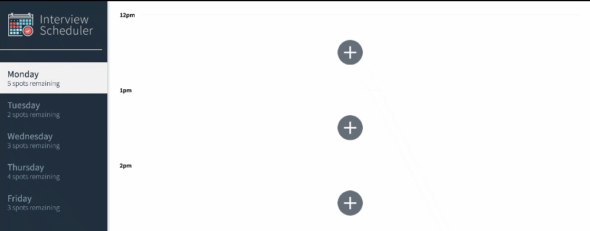
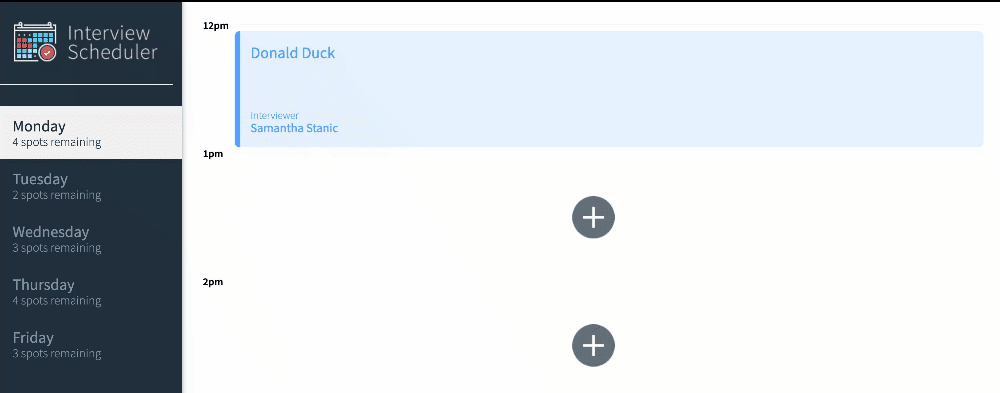
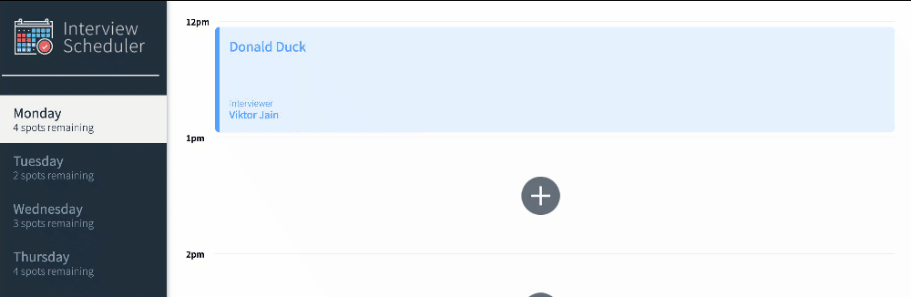

# Interview Scheduler
Scheduler is a React based application that makes 
scheduling interview appointments easy & fun! 
Add, edit and delete appointments easily for any 
day of the week. 

Enter the name of the student and select
An instructor. Form validation will stop any requests to the 
database if there is no student name entered or interview 
selected. If there are errors saving or deleting
Scheduler will let you know with an error message. 


## Adding an appointment



## Editing an appointment 



## Deleting an appointment 


## Handling an error 



## Setup

Install dependencies with `npm install`.

## Fork & Clone proxy server

[Click here for repo & instructions](https://github.com/lighthouse-labs/scheduler-api)

## Running Webpack Development Server

```sh
npm start
```

## Running Jest Test Framework

```sh
npm test
```

## Running Storybook Visual Testbed

```sh
npm run storybook
```
